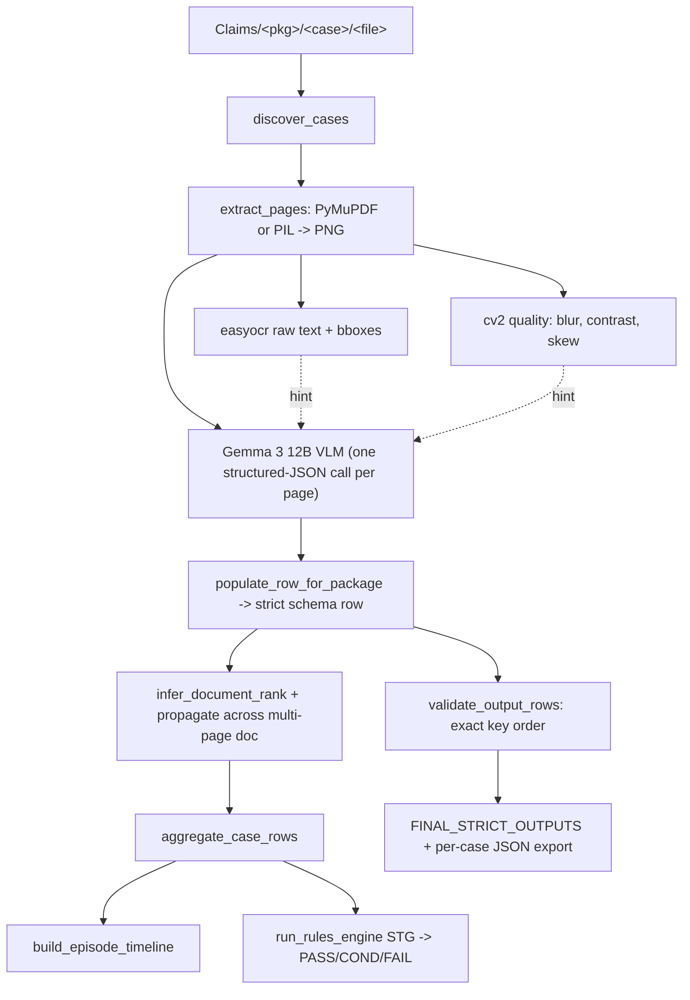

# NHA PS-01 VLM-Heavy Pipeline

## Architecture (one diagram)



## Source files & copy workflow

- **Step 0 (first action when execution begins):** make a copy of [`nha_ps1_skeletal_notebook_main.ipynb`](nha_ps1_skeletal_notebook_main.ipynb) → `nha_ps1_skeletal_notebook_main_filled.ipynb`. All edits land in the copy. The original stays untouched as a reference and as the canonical cell layout that the sandbox notebook mirrors.
- The copy preserves the exact 37-cell layout (0–36) of the skeleton so the user can copy each cell verbatim into the matching cell index of the sandbox notebook. No new cells are inserted, no cells are reordered. Only cell *contents* are filled in (or deleted for the broken stub cells 33–34).
- Borrow battle-tested snippets from [`v2.ipynb`](v2.ipynb): `extract_pages`, `estimate_page_quality`, `find_dates`/`find_age`/`contains_any`, ThreadPool VLM-call pattern, `_extract_json_object` JSON salvager.
- Schemas & validator already correct in skeleton cells 7 and 28 — keep as-is.

## Cell-by-cell alignment map (skeleton ↔ filled copy)

The user copies cell `N` of the filled notebook into cell `N` of the sandbox. Action column says what changes vs the skeleton.

- Cell 0 — md header — **keep as-is**.
- Cell 1 — imports — **edit**: prepend `!pip install pymupdf easyocr opencv-python pillow rapidfuzz python-dateutil`; add `import fitz, easyocr, cv2, base64, io, hashlib` and `from concurrent.futures import ThreadPoolExecutor`.
- Cell 2 — md databank instructions — **keep as-is**.
- Cell 3 — `DatabankDownloadWidget` — **keep as-is** (sandbox only; no-op locally).
- Cell 4 — CONFIG — **edit**: append `VLM_MODEL = "Gemma 3 12B"`, `VLM_FALLBACK = "Gemma 3 4B"`, `VLM_CONCURRENCY = 4`, `VLM_CACHE_DIR = OUTPUT_ROOT / "vlm_cache"` (mkdir), and `READER = None` placeholder + lazy `get_reader()` helper so the easyocr model loads only once.
- Cell 5 — md NHAclient docs — **keep as-is**.
- Cell 6 — NHAclient example — **edit**: keep the `nc = NHAclient(clientId, clientSecret)` line; remove the `Sample.jpg` demo so the cell is safe to run after creds are filled in.
- Cell 7 — `PACKAGE_SCHEMAS` + `KEY_ALIASES` — **keep as-is** (correct).
- Cell 8 — dataclasses — **keep as-is**.
- Cell 9 — md pipeline stages — **keep as-is**.
- Cell 10 — `iter_case_files` + `discover_cases` — **implement**. `discover_cases` walks `Claims/<package_code>/<case_id>/<files>`, returns `Dict[case_id, List[Path]]`, **and as a side effect populates the global `PACKAGE_CODE_LOOKUP` dict** (case_id → package_code). This keeps cell 36's runner working without changes to its lookup logic.
- Cell 11 — `extract_pages` — **implement**: PyMuPDF 2× zoom for PDFs, PIL for images, multi-frame TIFF supported, image resized so longest side ≤ 1280 px.
- Cell 12 — `run_ocr` — **implement** with **dict return** (`{"text": str, "ocr_lines": List[OCRLine]}`) to match the runner's expectation in cell 36 (the skeleton's docstring says tuple but the runner unpacks a dict).
- Cell 13 — `estimate_page_quality(page_image, extracted_text)` — **implement** (2 args, dict return) — port from v2.
- Cell 14 — `detect_visual_elements(page_image, extracted_text)` — **implement with 2 args** (skeleton declares 1 arg but the runner passes 2). Returns a normalized dict `{has_stamp, has_signature, has_qr_code, has_barcode, has_implant_sticker, has_photo_evidence, has_handwriting, has_table, has_letterhead, ...}`. We use the VLM to fill these (single call shared with classify in cell 15 via cache).
- Cell 15 — `classify_document_type(package_code, extracted_text, visual_tags)` — **implement with 3 args** (skeleton declares 2 args but the runner passes 3). Returns dict `{doc_type, confidence, evidence_flags, dates, age, is_extra_document, raw_vlm}`. **This is where the master VLM call lives** — it caches the structured JSON keyed by image hash so subsequent stages (and cell 14) reuse the same response.
- Cell 16 — `find_dates`, `find_age`, `contains_any` — **implement** (port from v2).
- Cell 17 — `populate_row_for_package` (first def) — **delete contents / leave a one-line comment** noting cell 19 is canonical (keeping the cell present preserves cell index alignment with the sandbox).
- Cell 18 — `normalize_output_key`, `initialize_output_row` — **implement**. `initialize_output_row` builds an *ordered* dict from `PACKAGE_SCHEMAS[package_code]` so key order is locked.
- Cell 19 — `populate_row_for_package(package_code, page_result)` — **canonical implementation** (matches runner's 2-arg call). Reads `page_result.entities` (where cell 15 stuffs the VLM JSON), maps `doc_type` → binary doc-type key, `evidence_flags` → package binary keys, `dates` (filtered by role) → package date keys via `normalize_date`, sets `extra_document`, applies regex-synonym backstop, returns the ordered row.
- Cell 20 — `infer_document_rank` + `RANK_MAP` — **implement** (RANK_MAP already populated in skeleton).
- Cell 21 — `build_episode_timeline` — **implement**: order events by `(rank, parsed_date)`, tag `temporal_validity`.
- Cell 22 — `aggregate_case_rows` + `run_rules_engine` (+ `MANDATORY_DOCS` already populated) — **implement**. Per-package STG checks + missing-doc check → `ClaimDecision(PASS|CONDITIONAL|FAIL)`.
- Cell 23 — `build_human_readable_summary`, `build_timeline_df` — **implement** (simple DataFrames matching ps.md sample table style).
- Cell 24 — `process_case` — **implement**: calls extract → ocr → quality → detect → classify → populate → rank → propagate → timeline → rules → summary.
- Cell 25 — `run_batch` — **implement** as a thin wrapper around the cell 36 logic (kept for parity with skeleton; cell 36 is the actual entry point used).
- Cell 26 — `load_example_jsons` — **keep as-is**. Will return `{}` locally because we don't have `data/*.json`; that's fine, it's only a sanity demo.
- Cell 27 — `export_case_outputs` — **implement**: write strict JSON, summary CSV, timeline CSV, decision JSON per case.
- Cell 28 — `validate_output_rows` — **keep as-is**.
- Cell 29 — validate organizer JSONs — **keep as-is** (no-op when example_jsons is empty).
- Cell 30 — md extensions — **keep as-is**.
- Cell 31 — `normalize_date` (working DD-MM-YYYY version) — **keep as-is**.
- Cell 32 — `normalize_dates_in_rows` (working version) — **keep as-is**.
- Cell 33 — broken `normalize_date` stub — **clear contents** to a single comment line `# intentionally empty - real impl in cell 31` (do NOT remove the cell, to preserve indices).
- Cell 34 — broken `normalize_dates_in_rows` stub — **clear contents** the same way (preserves indices, lets cell 32 win).
- Cell 35 — `render_decision_report` — **implement** (small print of case_id, package, decision, confidence, reasons, missing docs).
- Cell 36 — MAIN RUNNER — **edit**: insert `ThreadPoolExecutor(max_workers=VLM_CONCURRENCY)` over pages within a case, wrap each page in `try/except` with the existing schema-shaped fallback already in the skeleton, and add per-case progress prints. Also append a final block that writes `outputs/FINAL_STRICT_OUTPUTS.json` to disk.

## Signature contracts (runner is source of truth)

Cell 36 already calls these signatures. Our cell 12–19 implementations must match exactly so copy-paste-into-sandbox runs end-to-end without further edits:

- `run_ocr(page_image) -> dict` returning `{"text": str, "ocr_lines": List[OCRLine]}`.
- `estimate_page_quality(page_image, extracted_text: str) -> dict`.
- `detect_visual_elements(page_image, extracted_text: str) -> dict`.
- `classify_document_type(package_code: str, extracted_text: str, visual_tags: dict) -> dict` returning at minimum `{"doc_type": str, "confidence": float}`; we extend it with `evidence_flags`, `dates`, `age`, `is_extra_document`, `raw_vlm`.
- `populate_row_for_package(package_code: str, page_result: PageResult) -> dict` returning a row whose keys exactly equal `PACKAGE_SCHEMAS[package_code]` in order.
- `build_episode_timeline(package_code, page_results) -> List[TimelineEvent]`.
- `run_rules_engine(case_id, package_code, rows, timeline) -> ClaimDecision`.
- `build_human_readable_summary(package_code, page_results, decision) -> pd.DataFrame`.
- `build_timeline_df(timeline) -> pd.DataFrame`.

## The single VLM call per page (this is the core idea)

One Gemma 3 12B vision+text call per page. We send `(image, easyocr_text, package_code, allowed_doc_types_for_package, allowed_evidence_keys_for_package)` and demand a strict JSON back:

```json
{
  "doc_type": "<one of allowed_doc_types or extra_document>",
  "doc_type_confidence": 0.0,
  "corrected_text": "...",
  "visual_cues": {
    "has_stamp": false, "has_signature": false, "has_qr_code": false,
    "has_barcode": false, "has_implant_sticker": false, "has_photo_evidence": false,
    "has_handwriting": false, "has_table": false, "has_letterhead": false
  },
  "evidence_flags": { "<schema_key>": {"value": 0|1, "quote": "..."} },
  "dates": [ {"raw": "06-02-2026", "role": "pre_investigation|post_investigation|admission|discharge|other"} ],
  "age_years": null,
  "is_extra_document": 0,
  "notes": ""
}
```

Why one call: minimises latency/tokens, lets the model jointly reason about text + image + package context, and produces row-ready evidence with quoted provenance for the 40% rule/provenance score.

## Implementation tasks

### 1. Bootstrap & deps (cells 1, 4)

- Add `!pip install pymupdf easyocr opencv-python pillow pandas rapidfuzz python-dateutil`.
- Imports: `fitz`, `easyocr`, `cv2`, `base64`, `io`, `hashlib`, `concurrent.futures.ThreadPoolExecutor`, `dateutil`.
- Globals: `READER = easyocr.Reader(['en'], gpu=False)` (lazy-init), `VLM_MODEL = "Gemma 3 12B"`, `VLM_FALLBACK = "Gemma 3 4B"`, `VLM_CONCURRENCY = 4`, `VLM_CACHE_DIR = OUTPUT_ROOT / "vlm_cache"`.
- Keep `nc = NHAclient(clientId, clientSecret)` cell — leave creds blank for the user to fill in the sandbox.

### 2. Static package metadata (new cell after schemas)

Encode all package-specific knowledge in plain dicts so the rules engine and the VLM prompt builder both read from one source of truth:

- `PACKAGE_DOC_TYPES`: per-package allowed doc-type labels (intersection of `DOCUMENT_TYPES` and that package's row schema, plus `extra_document`).
- `PACKAGE_EVIDENCE_KEYS`: non-document binary keys per package (e.g. MG064A: `severe_anemia`, `common_signs`, `significant_signs`, `life_threatening_signs`).
- `PACKAGE_DATE_KEYS`: MG006A→`pre_date`,`post_date`; SB039A→`doa`,`dod`.
- `RANK_MAP` (already in cell 20) — reuse.
- `MANDATORY_DOCS` (already in cell 22) — reuse.
- STG age ranges (SB039A: 50–90 typical TKR; MG006A: any).
- Clinical synonym dictionaries per evidence_key (used as a regex backstop in case the VLM misses a quote).

### 3. Discovery & ingestion (cells 10, 11)

- `discover_cases(DATA_ROOT)` walks `Claims/<package_code>/<case_id>/<files>` and returns `Dict[case_id, (package_code, [Path, ...])]`. Skip `.DS_Store`, hidden files, unsupported extensions.
- `iter_case_files` per-case helper.
- `extract_pages(file_path)` — port from v2: PyMuPDF at 2x zoom for PDFs; PIL for images; multi-frame TIFF support; returns `[{page_number, image (PIL), file_name}]`. Resize so longest side ≤ 1280 px before stashing to keep VLM payloads small.

### 4. Quality + raw OCR (cells 12, 13)

- `run_ocr(page_image)` → `(full_text, [OCRLine])` using easyocr; flatten bbox to `[x1,y1,x2,y2,x3,y3,x4,y4]`; round confidence.
- `estimate_page_quality(page_image, extracted_text)` — port from v2 (Laplacian blur, contrast, noise, text density, Hough skew). Returns `{is_usable, is_blurry, is_low_contrast, is_skewed, blur_score, ...}`. Drives MG006A's `poor_quality` flag.

### 5. The VLM page analyzer (replaces cells 14, 15, 17, 19)

```python
def analyze_page_with_vlm(package_code, page_image, easyocr_text, quality) -> dict
```

- Build `data_url` from the (resized) PIL image.
- Hash image bytes → cache key. If cached JSON exists in `VLM_CACHE_DIR`, return it. This makes notebook re-runs cheap and survives the sandbox restarts.
- Construct the prompt programmatically from `PACKAGE_DOC_TYPES[package_code]` and `PACKAGE_EVIDENCE_KEYS[package_code]` so the model is forced to choose only valid labels for the active package.
- Call `nc.completion(model=VLM_MODEL, ...)`; on JSON-parse failure use `_extract_json_object` salvager (port from v2). On hard failure, retry once with `VLM_FALLBACK` model. On second failure, return a deterministic skeleton dict marked `low_confidence=True`.
- Persist parsed JSON to `VLM_CACHE_DIR`.

### 6. Row builder (cells 17/18/19)

- `initialize_output_row(package_code, case_id, file_name, page_number)` — initialize from `PACKAGE_SCHEMAS[package_code]` (preserves order), set identifiers, init binary keys to `0`, init date keys to `None`.
- `populate_row_for_package(package_code, page_result)`:
  - From VLM `doc_type` set the matching binary doc-type key to `1`; all others stay `0`.
  - From VLM `evidence_flags` populate package-specific binary keys (e.g. `severe_anemia`, `usg_calculi`, `arthritis_type`, `age_valid`).
  - From VLM `dates`: filter by `role` and write to package-specific date keys (`pre_date`/`post_date` or `doa`/`dod`); pass through `normalize_date` to `DD-MM-YYYY`.
  - For MG006A `poor_quality`: OR of VLM signal and `quality.is_blurry/is_low_contrast`.
  - Regex backstop: if a key is `0` but the synonym dict from §2 hits the corrected text, flip to `1`. Cheap recall boost.
  - `extra_document = 1` iff `doc_type == "extra_document"`.

### 7. Ranking + multi-page propagation (cell 20)

- `infer_document_rank(package_code, row, doc_type)` looks up `RANK_MAP[package_code]`, defaults to `99` for `extra_document`.
- After all pages of one source PDF are built, propagate the most common non-99 rank back to all of that PDF's pages so a multi-page document gets a single rank (per ps.md rule).

### 8. Timeline + rules engine (cells 21, 22)

- `aggregate_case_rows(rows)` collapses per-page binary flags via OR across the case → `case_evidence` dict.
- `build_episode_timeline(package_code, page_results)` orders events by `(rank, date)`; tags `temporal_validity` (`Valid`, `Before procedure`, `After treatment`, `Out of order`).
- `run_rules_engine(case_id, package_code, rows, timeline)`:
  - Missing-docs check vs `MANDATORY_DOCS`.
  - Package-specific STG checks (e.g. SB039A: `arthritis_type=1` AND `age_valid=1` AND `post_op_implant_present=1` AND `dod >= doa`; MG006A: `fever=1` AND `pre_date` present, `post_date >= pre_date` if present).
  - Returns `ClaimDecision` with `PASS` (all critical pass), `FAIL` (mandatory docs missing or hard STG fail), `CONDITIONAL` (gray zone — surfaced for review).

### 9. Validator + export (cells 27, 28)

- Keep `validate_output_rows` as-is.
- `export_case_outputs(case_result)` writes:
  - `outputs/strict/<case_id>.json` — list of strict rows.
  - `outputs/summary/<case_id>.csv` — reviewer table.
  - `outputs/timeline/<case_id>.csv`.
  - `outputs/decisions/<case_id>.json`.
- Final cell writes the merged `outputs/FINAL_STRICT_OUTPUTS.json` keyed by case_id (matches what evaluator reads).

### 10. Main runner (cell 36)

Patch the runner to:
- Use `discover_cases` that returns `(package_code, files)` directly (no `PACKAGE_CODE_LOOKUP` / `package_code.txt` fallback needed since dataset layout is `Claims/<pkg>/<case>/`).
- Process each case sequentially; within a case, parallelize VLM calls over its pages with `ThreadPoolExecutor(max_workers=VLM_CONCURRENCY)`.
- Wrap each page in `try/except`: on failure emit a schema-shaped fallback row so the run never crashes mid-batch and the validator stays happy.
- Print per-case progress (`[3/40] MG064A/PMJAY_AR_S_2025... 8 files / 12 pages / 11s`) so long runs are observable.

### 11. Date normalization (cells 31, 33)

- Keep cell 31's working `normalize_date` (it already targets `DD-MM-YYYY`).
- **Delete cells 33 and 34** — they are stub-overrides that wipe the working version when the notebook is run top-to-bottom (called out in ps.md note).
- Same for any duplicate `populate_row_for_package` (cells 17 vs 19) — keep one canonical definition.

## What we will NOT do (scope discipline)

- No fine-tuning, no custom model training.
- No Detectron2 / LayoutLM — the VLM subsumes layout for our scoring weights.
- No multilingual OCR pack beyond easyocr `['en']` initially (Hindi/regional is rare per file naming; revisit only if recall is bad).
- No on-disk DB — flat JSON cache files are enough.

## Success criteria (verifiable)

1. `discover_cases(DATA_ROOT)` returns 40 cases across 4 packages → verify by `len()` and per-package counts (10/10/10/10).
2. End-to-end run on 1 case per package produces 4 valid `FINAL_STRICT_OUTPUTS` entries; `validate_output_rows(pkg, rows)` returns `(True, [])` for all 4.
3. Date keys (`pre_date`, `post_date`, `doa`, `dod`) are either `None` or strings matching `^\d{2}-\d{2}-\d{4}$`.
4. `extra_document=1` iff `document_rank=99` for every row.
5. Multi-page PDFs: all pages of the same PDF share the same `document_rank` (unless `99`).
6. Full batch (40 cases) completes within sandbox memory (<10 GiB) and produces `outputs/FINAL_STRICT_OUTPUTS.json`.
7. Spot-check 1 case per package against the example JSONs in `data/*.json` (loaded by cell 26) for key/order parity.

## Suggested execution order after plan approval

1. Make notebook copy `nha_ps1_skeletal_notebook_main_filled.ipynb` + cleanup (clear stub-cell contents, leave cells in place, dedupe `populate_row_for_package`).
2. Wire deps + `nc` client cell.
3. Implement discovery + ingestion + raw OCR + quality (testable locally without VLM creds).
4. Implement single-shot VLM analyzer with cache.
5. Implement row builder + rank propagation + validator pass.
6. Implement timeline + rules engine + decisions.
7. Implement exporters + main runner.
8. Dry-run on 1 case per package, fix schema drift, then run all 40.

## Sanity check vs ps.md (every requirement → where it's handled)

- **"Strict JSON output, one object per page"** → cell 36 runner appends one row per page; `FINAL_STRICT_OUTPUTS` is `Dict[case_id, List[row]]`.
- **"Support all 4 package codes"** → `PACKAGE_SCHEMAS` (cell 7) covers `MG064A`, `SG039C`, `MG006A`, `SB039A`; `discover_cases` (cell 10) walks all 4.
- **"Exact key names AND exact key order"** → `initialize_output_row` (cell 18) builds rows from `PACKAGE_SCHEMAS[package_code]`; `validate_output_rows` (cell 28) enforces `row_keys != expected` ⇒ fail.
- **"1/0 for binary, null for missing dates"** → `initialize_output_row` defaults binaries to `0` and dates (`pre_date`, `post_date`, `doa`, `dod`) to `None`; populate logic only flips to `1` on positive evidence and only writes a date string after `normalize_date` succeeds (else leaves `None`).
- **"`case_id` from case folder name"** → `discover_cases` keys on `case_dir.name`.
- **"`procedure_code` exactly matches parent package folder"** → `populate_row_for_package` writes `row["procedure_code"] = package_code` where `package_code` came from `Claims/<package_code>/...` walk.
- **"`page_number` 1 for single image, sequential for PDF"** → `extract_pages` (cell 11) sets `page_number=1` for images, enumerates PDF pages from 1.
- **"`extra_document = 1` outside STG list"** → `populate_row_for_package` sets `extra_document = int(doc_type == "extra_document")`.
- **"`document_rank = 99` for extras"** → `infer_document_rank` returns `99` for `extra_document`; defaults to 99 for unknown labels.
- **"Multi-page document → same rank across pages"** → post-pass in cell 19/20 propagates the modal non-99 rank to every page sharing `(case_id, file_name)`.
- **"Date format DD-MM-YYYY for `MG006A.pre_date/post_date` and `SB039A.doa/dod`"** → cell 31's `normalize_date` returns `dt.strftime("%d-%m-%Y")`; `populate_row_for_package` calls it for those four keys.
- **"Schema link-key caveat: `MG064A`/`SB039A` use `link`; `SG039C`/`MG006A` use `S3_link/DocumentName`"** → `PACKAGE_SCHEMAS` (cell 7) is already correct; `populate_row_for_package` writes the file path/name into whichever key the schema declares (no aliasing at output time).
- **"Beware duplicate stub cells (33, 34) overriding earlier working defs"** → cells 33, 34 are emptied to comments so cells 31, 32 win at top-to-bottom execution.
- **"Signature inconsistencies between defs and runner (`run_ocr`, `detect_visual_elements`, `classify_document_type`)"** → addressed in the *Signature contracts* subsection above; our cell 12/14/15 implementations match the runner's call sites.
- **"Preserve provenance: text span / page / confidence per evidence item"** → VLM returns `evidence_flags[key] = {"value": 0|1, "quote": str}`; we stash this on `PageResult.evidence` and include in the human-readable summary + decision JSON. Strict row stays binary as required.
- **"Decision: PASS / CONDITIONAL / FAIL with reasons"** → `run_rules_engine` (cell 22) returns `ClaimDecision`; `render_decision_report` (cell 35) prints it.
- **"Sandbox 4–6 cores / 10–12 GiB; cache expensive renders + OCR + VLM"** → `VLM_CACHE_DIR` stores per-image VLM JSON; `READER` is module-singleton easyocr; images resized to 1280px before base64; `VLM_CONCURRENCY=4` matches CPU budget; per-case results released to disk via `export_case_outputs` so memory stays bounded.
- **"Output files from `export_case_outputs`: strict JSON, summary table, timeline table, decision record"** → all four are emitted in cell 27.

## Hand-off to user (after implementation)

When implementation finishes, open `nha_ps1_skeletal_notebook_main_filled.ipynb` in Cursor. For each cell `N` (0–36), copy the contents into the matching cell `N` of the sandbox notebook. Then in the sandbox:
1. Run cell 3 (databank widget) and download the data into `Claims/`.
2. Fill `clientId` / `clientSecret` in cell 6 and run it.
3. Run cells 1, 4, 7, 8, 10–32, 35 to define everything.
4. Run cell 36 to execute the batch.
5. Inspect `outputs/FINAL_STRICT_OUTPUTS.json` and the per-case files under `outputs/strict/`.

Remember you're always allowed web fetch to look at the docs to ensure accurate code and any issue, you can run manually by me.